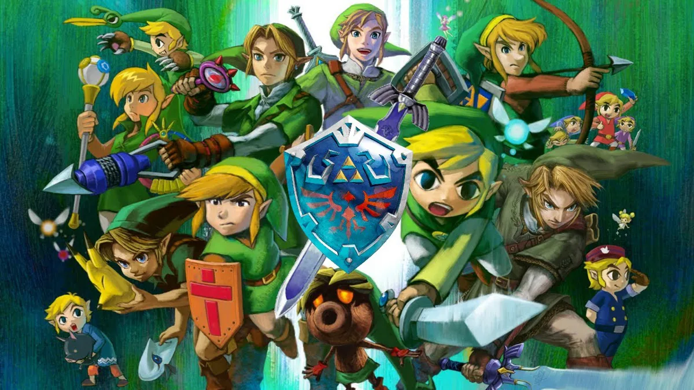

# 3️⃣ Escrevendo as classes de um Jogo

    

**O Que deve ser utilizado** 

- Variáveis
- Operadores
- Laços de repetição
- Estruturas de decisões
- Funções
- Classes e Objetos

## Objetivo:

Crie uma classe generica que represente um herói de uma aventura e que possua as seguintes propriedades:

- nome
- idade
- tipo (ex: guerreiro, mago, monge, ninja )

além disso, deve ter um método chamado atacar que deve atender os seguientes requisitos:

- exibir a mensagem: "o {tipo} atacou usando {ataque}")
- aonde o {tipo} deve ser concatenando o tipo que está na propriedade da classe
- e no {ataque} deve seguir uma descrição diferente conforme o tipo, seguindo a tabela abaixo:

- se mago -> no ataque exibir (usou magia)
- se guerreiro -> no ataque exibir (usou espada)
- se monge -> no ataque exibir (usou artes marciais)
- se ninja -> no ataque exibir (usou shuriken)

## Saída

- Ao final deve se exibir uma mensagem:

"o {tipo} atacou usando {ataque}"
  ex: mago atacou usando magia
  guerreiro atacou usando espada

<h2 id="Aluno">💻 Aluno</h2>

    
    
&nbsp&nbsp&nbspLuide Lima 
      
    &nbsp&nbsp&nbsp<a href="http://instagram.com/programi_">Instagram</a>&nbsp;|&nbsp;<a href="https://github.com/micheleambrosio">GitHub</a>&nbsp;|&nbsp;<a href="https://www.linkedin.com/in/michele-ambrosio-a4899661/">LinkedIn</a>&nbsp;|&nbsp;<a href="https://www.twitch.tv/michele_ambrosio">Twitch</a>

  

